<!--
 * @Date: 2024-10-05
 * @LastEditors: GoKo Son626
 * @LastEditTime: 2024-10-05
 * @FilePath: \undefinedc:\Users\49551\Desktop\About-whv\whv.md
 * @Description: 
-->
# whv预申请流程

> ##### 所需材料：
> - 护照
> - 银联卡，paypal，Visa或澳大利亚存储卡等（支付申请费用，以银联卡为例需要卡号，卡背签名处后三位安全码等）
> - 个人邮箱（验证）

### 1. 注册/登录

- 无账号跟着注册提示直接注册账号即可（比较简单）
**登录成功如图所示：**
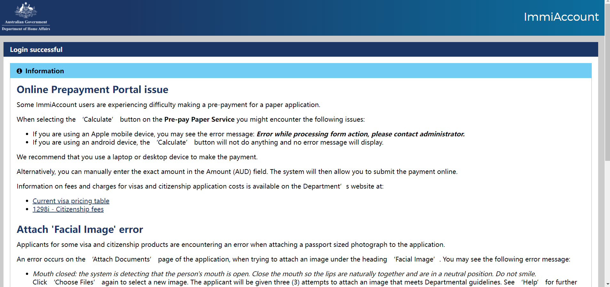

### 2. 申请
> 注意：浏览器中只打开当前网页，不然会提示error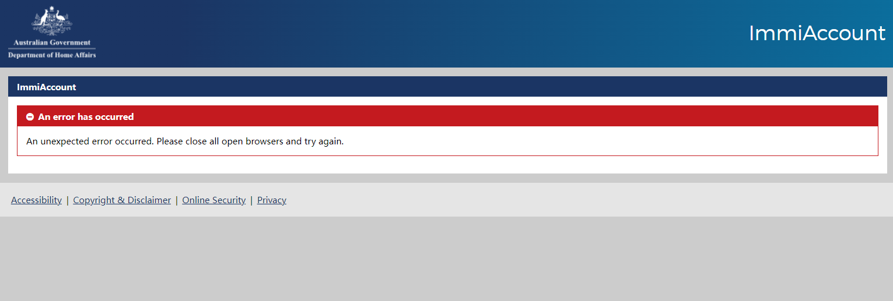

- 1. 翻到最低页，点击continue
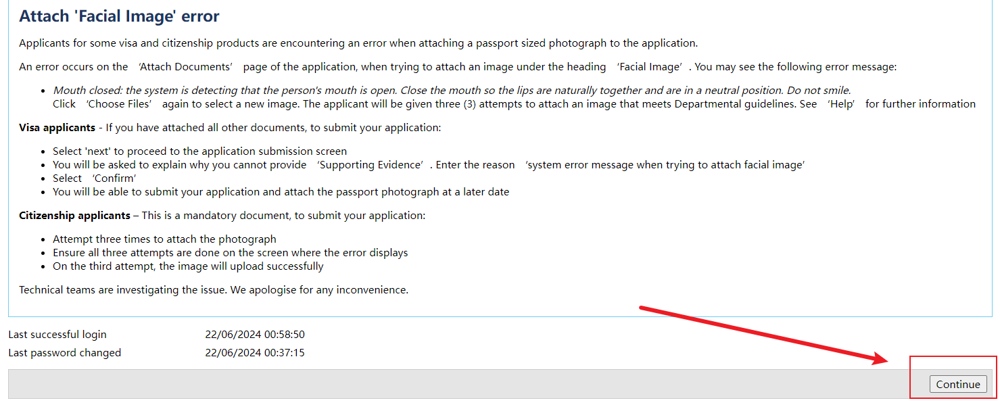
- 2. 进去后点击New applications
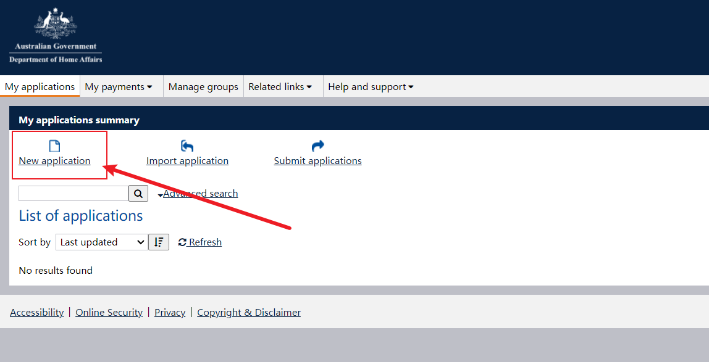
- 3. 然后点击倒数第三个（预申请），选择462
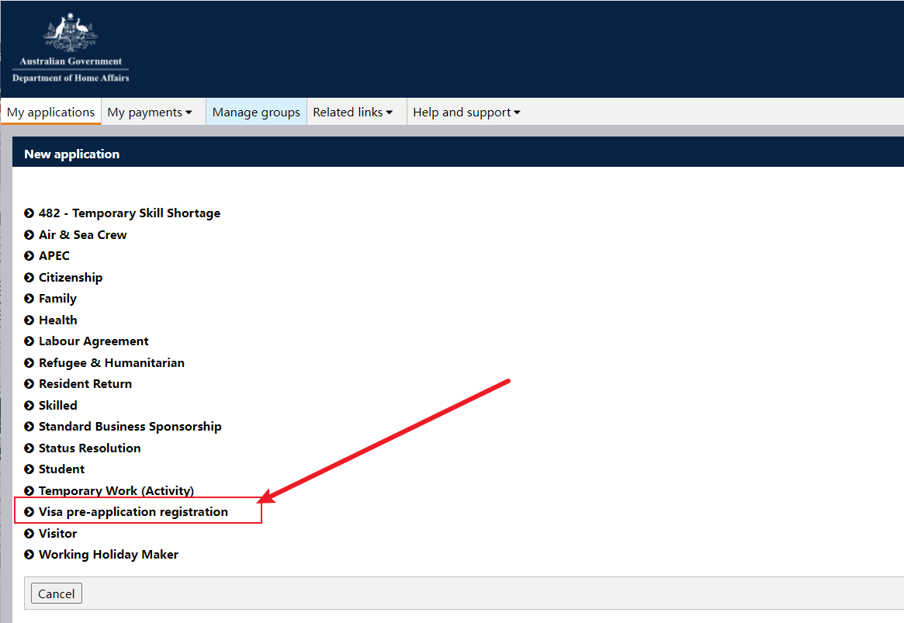
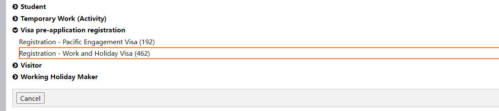
- 4. 个人信息页面
**全部勾选**
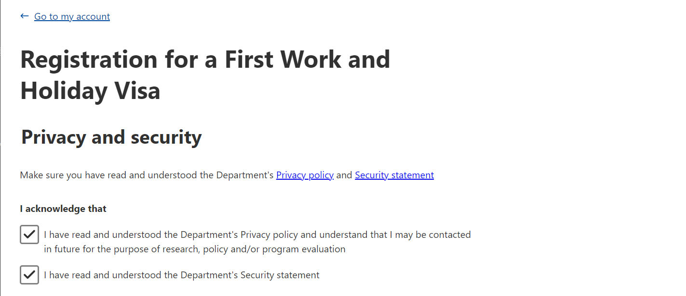
**姓和名尽量和护照上大小写一样**
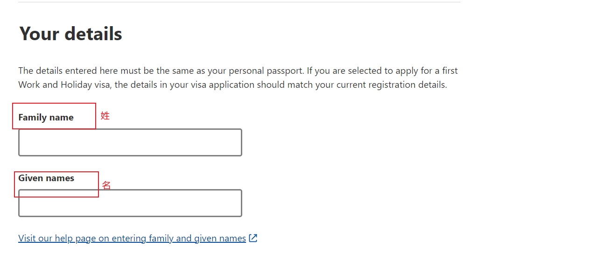
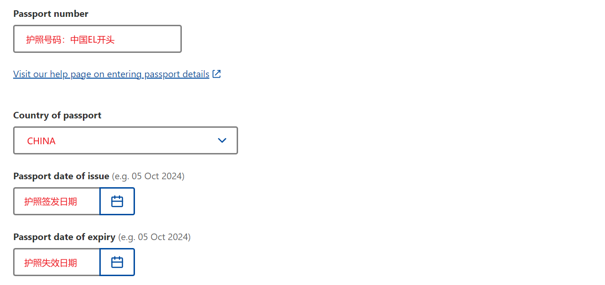
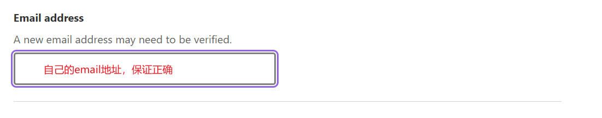
**全部勾选，然后点击底部save保存或review浏览一遍后再save保存**
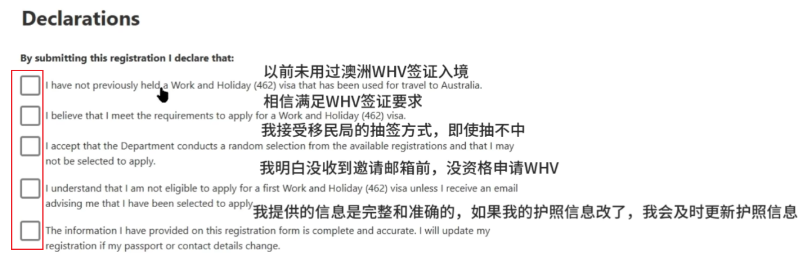

### 3. 付款（可使用银联，paypal，Visa或澳大利亚存储卡） 

> 以银联为例需要填写：
> - 银联卡号
> - 银联卡后签名区后三位验证码
> - 银行预留电话
**填写完成后发送验证码并付款**

### 4. 申请成功
**申请完成后主页会有reviewed信封**
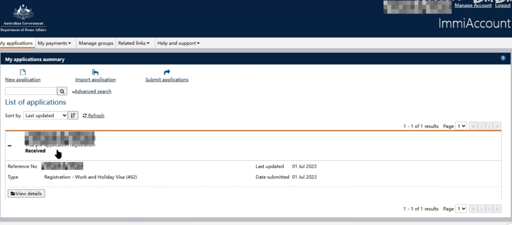
**同时邮箱会收到一个邮件通知已成功提交申请**
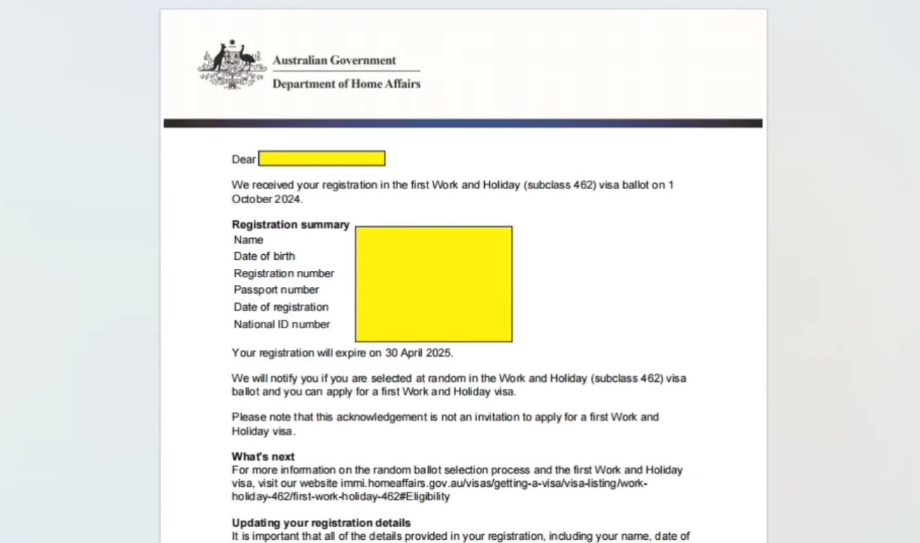

### 5. 静待通知邮件
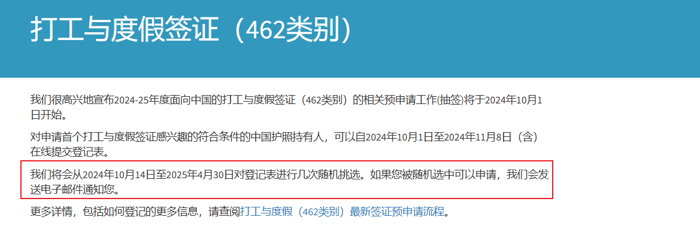